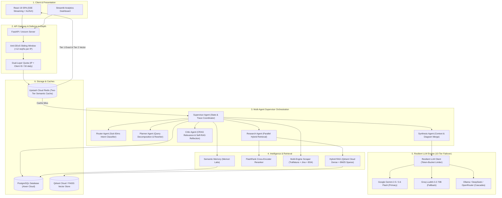
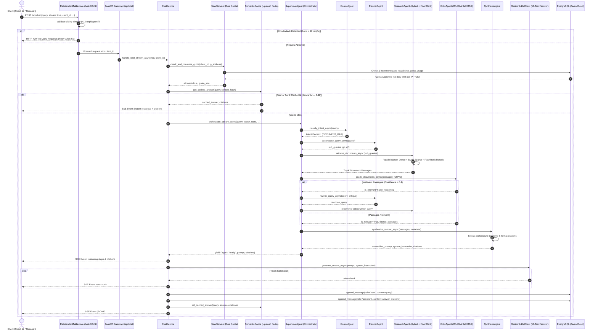
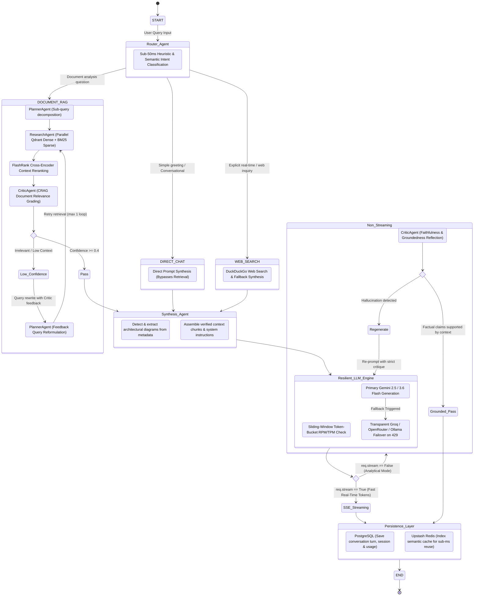

# WebChat AI: System Architecture and Technical Design

This document provides a comprehensive architectural analysis of the WebChat platform based on the codebase implementation.

## 1. High-Level System Architecture

WebChat provides a dual-interface conversational AI platform supporting both a React 19 single-page application and a Streamlit analytical dashboard. The backend is built with FastAPI and orchestrates an asynchronous multi-agent supervisor pipeline with hybrid retrieval (dense vectors, sparse BM25, and FlashRank cross-encoder reranking), multi-provider LLM fallback cascades (Google Gemini, Groq, and Ollama), semantic caching, and relational persistence via PostgreSQL.

## 2. End-to-End Data and Request Flow

The diagram below maps the complete lifecycle of a chat request from the client interface down to security middleware, quota checks, multi-agent orchestration, hybrid retrieval, streaming generation, and persistence.

## 3. Detailed AI and Agentic RAG Pipeline (Multi-Agent Supervisor Workflow)

The core intelligence layer operates as an asynchronous multi-agent supervisor architecture implementing Corrective RAG (CRAG), Self-RAG reflection, and Parallel Hybrid Retrieval.

## 4. Component Catalog and Responsibilities

### 4.1 Client and Presentation Layer

| Component               | Path                                                                           | Responsibility                                                                                                                                              | Technologies / Dependencies                         |
| :---------------------- | :----------------------------------------------------------------------------- | :---------------------------------------------------------------------------------------------------------------------------------------------------------- | :-------------------------------------------------- |
| **Web SPA Interface**   | [frontend/](file:///d:/Projects/Personal-Projects/webchat/frontend/)           | Production web client with dark theme, real-time citation cards, SSE streaming event reader, model switcher, session history drawer, and diagram rendering. | React 19, Tailwind CSS, Vite, EventSource API       |
| **Streamlit Dashboard** | [streamlit_app/](file:///d:/Projects/Personal-Projects/webchat/streamlit_app/) | Analytical interface offering model telemetry, chat history inspection, vector store exploration, document ingestion, and quota tracking.                   | Streamlit 1.40+, Custom CSS, Threading Queue Bridge |

### 4.2 API and Gateway Layer

| Component                  | Path                                                                                                   | Responsibility                                                                                                                         | Technologies / Dependencies             |
| :------------------------- | :----------------------------------------------------------------------------------------------------- | :------------------------------------------------------------------------------------------------------------------------------------- | :-------------------------------------- |
| **FastAPI Core App**       | [backend/app/main.py](file:///d:/Projects/Personal-Projects/webchat/backend/app/main.py)               | Application entry point; initializes CORS, registers security headers, manages database lifespan, and mounts routers.                  | FastAPI 0.115+, Starlette, Uvicorn      |
| **Anti-DDoS Rate Limiter** | [rate_limiter.py](file:///d:/Projects/Personal-Projects/webchat/backend/app/core/rate_limiter.py)      | High-speed in-memory sliding-window token bucket shield intercepting flood attacks (>12 req/5s) and scraper abuse at connection layer. | FastAPI BaseHTTPMiddleware, TokenBucket |
| **Security Headers**       | [security.py](file:///d:/Projects/Personal-Projects/webchat/backend/app/core/security.py)              | Injects standard security HTTP headers into every response (nosniff, DENY, X-XSS-Protection, Referrer-Policy).                         | Starlette Middleware                    |
| **Chat API Routes**        | [chat_routes.py](file:///d:/Projects/Personal-Projects/webchat/backend/app/api/chat_routes.py)         | Handles `/api/chat` (JSON / SSE stream with IP defense), `/api/scrape`, `/api/crawl`, and `/api/models`.                               | FastAPI APIRouter, StreamingResponse    |
| **User & Quota Routes**    | [user_routes.py](file:///d:/Projects/Personal-Projects/webchat/backend/app/api/user_routes.py)         | Handles `/api/user/identify`, `/api/user/quota`, `/api/sessions` (list & create), and `/api/sessions/{session_id}` (get & delete).     | FastAPI APIRouter, Dependency Injection |
| **Frontend Router**        | [frontend_routes.py](file:///d:/Projects/Personal-Projects/webchat/backend/app/api/frontend_routes.py) | Serves the single-page application and static asset fallbacks.                                                                         | StaticFiles, FileResponse               |

### 4.3 Application Core and Orchestration

| Component           | Path                                                                                                        | Responsibility                                                                                                                                | Technologies / Dependencies |
| :------------------ | :---------------------------------------------------------------------------------------------------------- | :-------------------------------------------------------------------------------------------------------------------------------------------- | :-------------------------- |
| **ChatService**     | [chat_service.py](file:///d:/Projects/Personal-Projects/webchat/backend/app/services/chat_service.py)       | Business logic orchestrator; handles quota consumption, persists user questions/answers, checks semantic cache, and triggers agent streaming. | Python 3.11+, asyncio       |
| **SupervisorAgent** | [supervisor_agent.py](file:///d:/Projects/Personal-Projects/webchat/backend/app/agents/supervisor_agent.py) | Orchestrator delegating workflow across specialized agents, tracking execution traces and telemetry.                                          | Python 3.11+, Protocols     |
| **RouterAgent**     | [router_agent.py](file:///d:/Projects/Personal-Projects/webchat/backend/app/agents/router_agent.py)         | Intent classification agent determining routing across direct conversation, document RAG, and web search.                                     | Pydantic, Gemini Client     |
| **PlannerAgent**    | [planner_agent.py](file:///d:/Projects/Personal-Projects/webchat/backend/app/agents/planner_agent.py)       | Sub-query decomposition agent and query rewriter responding to Critic feedback.                                                               | Pydantic, Gemini Client     |
| **ResearchAgent**   | [research_agent.py](file:///d:/Projects/Personal-Projects/webchat/backend/app/agents/research_agent.py)     | Concurrent hybrid retrieval agent combining Qdrant dense vectors, BM25 sparse search, and FlashRank reranking.                                | FlashRank, Qdrant, asyncio  |
| **CriticAgent**     | [critic_agent.py](file:///d:/Projects/Personal-Projects/webchat/backend/app/agents/critic_agent.py)         | Verification agent executing Corrective RAG document relevance grading and Self-RAG hallucination checking.                                   | Pydantic, Gemini Client     |
| **SynthesisAgent**  | [synthesis_agent.py](file:///d:/Projects/Personal-Projects/webchat/backend/app/agents/synthesis_agent.py)   | Assembles verified context passages, extracts architectural diagrams, and prepares citations.                                                 | Pydantic, Python 3.11+      |
| **UserService**     | [user_service.py](file:///d:/Projects/Personal-Projects/webchat/backend/app/services/user_service.py)       | Manages dual-layer quota tracking (Client ID + IP address, 50 queries/day reset at UTC midnight).                                             | SQLAlchemy, datetime        |

### 4.4 RAG, Scraper, Memory and Vector Services

| Component          | Path                                                                                                        | Responsibility                                                                                                       | Technologies / Dependencies                  |
| :----------------- | :---------------------------------------------------------------------------------------------------------- | :------------------------------------------------------------------------------------------------------------------- | :------------------------------------------- |
| **RAGService**     | [rag_service.py](file:///d:/Projects/Personal-Projects/webchat/backend/app/services/rag_service.py)         | Document chunking, dense embedding with GeminiEmbeddings, Qdrant Cloud hybrid ingestion, and Reciprocal Rank Fusion. | Qdrant Cloud, FAISS-CPU, rank-bm25           |
| **RerankService**  | [rerank_service.py](file:///d:/Projects/Personal-Projects/webchat/backend/app/services/rerank_service.py)   | Local cross-encoder reranker refining top hybrid retrieval candidates down to the most relevant contexts.            | FlashRank                                    |
| **ScraperService** | [scraper_service.py](file:///d:/Projects/Personal-Projects/webchat/backend/app/services/scraper_service.py) | Ingests URLs and PDFs with multi-tier fallback: Trafilatura, BeautifulSoup, Jina Reader API, and Internet Archive.   | Trafilatura, BeautifulSoup4, PyPDF, Requests |
| **MemoryService**  | [memory_service.py](file:///d:/Projects/Personal-Projects/webchat/backend/app/services/memory_service.py)   | Connects to Memori Labs; records conversation turns and extracts facts automatically.                                | memori, SQLAlchemy                           |
| **QdrantService**  | [qdrant_service.py](file:///d:/Projects/Personal-Projects/webchat/backend/app/services/qdrant_service.py)   | Cloud vector database hosting dense embeddings (3072-dim Cosine) and BM25 sparse vectors.                            | qdrant-client                                |

### 4.5 LLM Multi-Provider Fallback Cascade and Rate Limiter

| Component              | Path                                                                                                   | Responsibility                                                                                                    | Technologies / Dependencies |
| :--------------------- | :----------------------------------------------------------------------------------------------------- | :---------------------------------------------------------------------------------------------------------------- | :-------------------------- |
| **ResilientLLMClient** | [llm_client.py](file:///d:/Projects/Personal-Projects/webchat/backend/app/clients/llm_client.py)       | Transparently cascades through 10 priority models across Google Gemini and Groq if rate limits or timeouts occur. | google-genai, groq          |
| **Rate Limiter Core**  | [rate_limiter.py](file:///d:/Projects/Personal-Projects/webchat/backend/app/core/rate_limiter.py)      | Thread-safe token buckets, sliding window RPM monitors, and exponential cooldown trackers.                        | threading.Lock, time        |
| **GeminiClient**       | [gemini_client.py](file:///d:/Projects/Personal-Projects/webchat/backend/app/clients/gemini_client.py) | Google GenAI SDK wrapper handling generation and streaming.                                                       | google-genai                |
| **GroqClient**         | [groq_client.py](file:///d:/Projects/Personal-Projects/webchat/backend/app/clients/groq_client.py)     | Groq SDK client for fast failover models (LLaMA 3.3 70B).                                                         | groq                        |

### 4.6 Storage, Databases and Caches

| Store                            | Location / Mechanism      | Schema / Structure                                                                                                                |
| :------------------------------- | :------------------------ | :-------------------------------------------------------------------------------------------------------------------------------- |
| **Relational Database**          | PostgreSQL on Aiven Cloud | Tables for users, sessions, messages, guest usage by IP/CID, and URL cache with SHA-256 hashes.                                   |
| **Memori Labs Storage**          | PostgreSQL tables         | Tables for user entities, sessions, conversations, and knowledge graph facts.                                                     |
| **Upstash Redis Semantic Cache** | Upstash Cloud Redis       | Two-tier semantic cache: Tier 1 instant SHA-256 exact match (<1ms) and Tier 2 dense vector cosine similarity (threshold >= 0.92). |
| **Cloud Vector Database**        | Qdrant Cloud Cluster      | Primary vector database hosting dense embeddings (3072-dim Cosine) and BM25 sparse vectors. Local FAISS acts as secondary backup. |

## 5. Security and Authentication Model

1. **Guest Device Tier**:
   - Devices are identified by a persistent UUID Client ID and their client IP address.
   - Guests receive 50 queries per day, tracked in PostgreSQL.
   - Both the Client ID and the client IP address are evaluated, preventing users from resetting their quota by clearing browser storage.
   - Quotas automatically reset daily at 00:00:00 UTC.

2. **HTTP Security Headers**:
   - X-Content-Type-Options: nosniff
   - X-Frame-Options: DENY
   - X-XSS-Protection: 1; mode=block
   - Referrer-Policy: strict-origin-when-cross-origin

3. **Input Sanitization**:
   - Strips null bytes and control characters from queries and document inputs.

## 6. Background Jobs, Concurrency and Threading Architecture

The system utilizes an asynchronous event-driven architecture coupled with managed thread pools and queues to handle long-running I/O without blocking:

1. **Async and Sync Generator Streaming Bridge (`chat_agent.py`)**:
   - Streamlit operates in a synchronous execution thread per session, while LLM clients operate asynchronously via `asyncio`.
   - A dedicated daemon thread runs an isolated event loop, passing tokens, thinking steps, and citations into a thread-safe `queue.Queue`.
   - The caller consumes items from the queue with an active timeout, terminating on a sentinel token or raising cleanly on exceptions.

2. **Parallel Web and Domain Crawler (`scraper_service.py`)**:
   - Domain crawling and paywall bypass use a thread pool executor.
   - Scraping tasks run in parallel across worker threads, utilizing timeout budgets and connection pools.

3. **Background Semantic Memory Ingestion (`memory_service.py`)**:
   - Memori Labs hooks into LLM invocations, executing knowledge graph extraction asynchronously so response generation latency is not impacted.

### Production Architectural Guarantees

- **Strictly Top-Level Imports**: Every Python module enforces static, top-level imports with zero inline imports.
- **Zero Namespace Collisions**: Modern namespace packaging across all backend domain packages.
- **Dedicated FAISS Disk Vector Store**: FAISS is persisted to disk under `data/vector_storage/`, while Qdrant operates in the cloud.
- **Start-to-End Exception Boundaries**: Functions and route handlers implement structured error handling with contextual logging.
