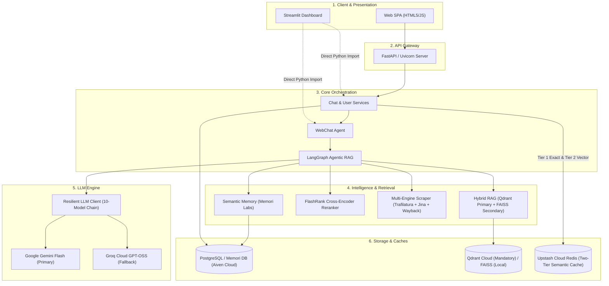
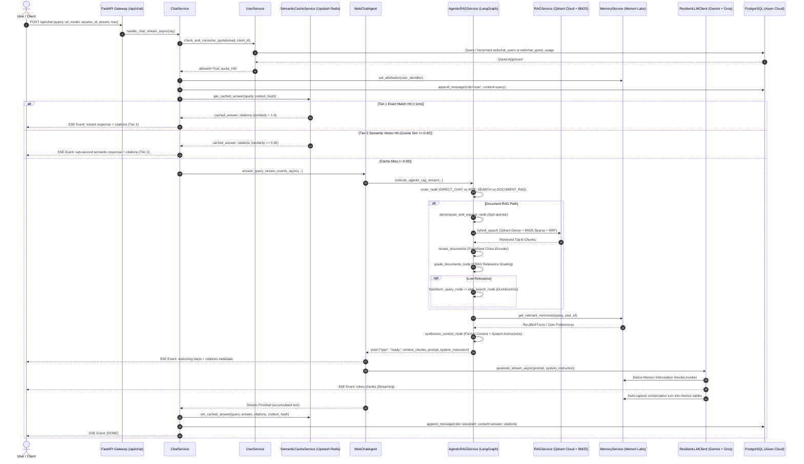
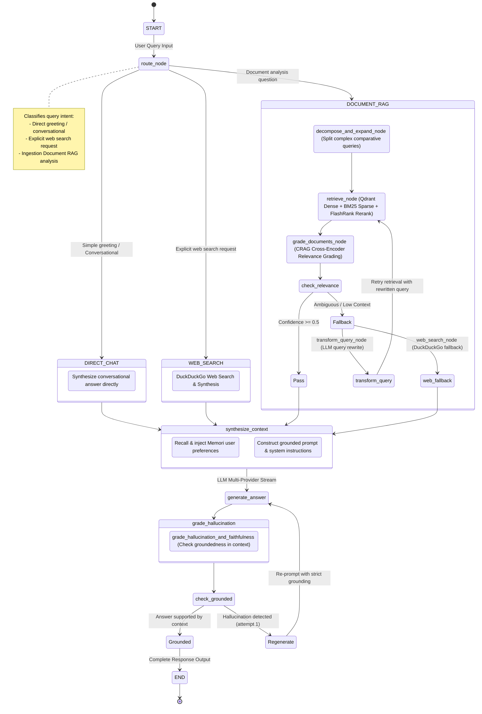

# WebChat AI — System Architecture & Technical Design

This document provides a comprehensive, production-grade architectural analysis of the **WebChat AI** platform based strictly on the actual codebase implementation.

---

## 1. High-Level System Architecture

WebChat AI provides a dual-interface conversational AI platform supporting both a **single-page web application (SPA)** and a **Streamlit analytical dashboard**. The backend is built with **FastAPI** and orchestrates an **Agentic RAG (Retrieval-Augmented Generation)** pipeline driven by **LangGraph**, utilizing hybrid retrieval (dense vectors + sparse BM25 + reciprocal rank fusion + cross-encoder reranking), multi-provider LLM fallback cascades (Google Gemini & Groq), persistent user semantic memory (Memori Labs), multi-tier paywall bypassing, and structured relational persistence via PostgreSQL/SQLite.

---

## 2. End-to-End Data & Request Flow

The diagram below maps the complete lifecycle of a chat request from the user interface down to storage, retrieval, generation, streaming, and automatic memory extraction.

---

## 3. Detailed AI & Agentic RAG Pipeline (LangGraph Workflow)

The retrieval engine is built on **LangGraph** (`AgenticRAGService`), incorporating **Corrective RAG (CRAG)**, **Self-RAG (Faithfulness/Hallucination grading)**, and **Hybrid RRF Search**.

---

## 4. Component Catalog & Responsibilities

### 4.1 Client & Presentation Layer

| Component                     | Path                                                                          | Responsibility                                                                                                                                                                                                   | Technologies / Dependencies                                                          |
| :---------------------------- | :---------------------------------------------------------------------------- | :--------------------------------------------------------------------------------------------------------------------------------------------------------------------------------------------------------------- | :----------------------------------------------------------------------------------- |
| **Web SPA Interface**   | [frontend/](file:///d:/Projects/Personal-Projects/webchat/frontend/)           | Ultra-responsive, production-grade web client with glassmorphic dark theme, real-time citation cards, SSE streaming event reader, model selection switcher, session history drawer, and quick ingestion buttons. | HTML5, Vanilla CSS (`index.css`), Vanilla JavaScript (`app.js`), EventSource API |
| **Streamlit Dashboard** | [streamlit_app/](file:///d:/Projects/Personal-Projects/webchat/streamlit_app/) | Full-featured secondary analytical interface offering real-time model telemetry, chat history inspection, manual vector store exploration, document ingestion, and quota dials.                                  | Streamlit 1.40+, Custom CSS (`styles.py`), Threading Queue Bridge                  |

---

### 4.2 API & Gateway Layer

| Component                     | Path                                                                                                  | Responsibility                                                                                                                                      | Technologies / Dependencies             |
| :---------------------------- | :---------------------------------------------------------------------------------------------------- | :-------------------------------------------------------------------------------------------------------------------------------------------------- | :-------------------------------------- |
| **FastAPI Core App**    | [backend/app/main.py](file:///d:/Projects/Personal-Projects/webchat/backend/app/main.py)               | Application entry point; initializes CORS, registers security headers, manages lifespan (DB migration + Memori storage build), and mounts routers.  | FastAPI 0.115+, Starlette, Uvicorn      |
| **Security Headers**    | [security.py](file:///d:/Projects/Personal-Projects/webchat/backend/app/core/security.py)              | Injects standard security HTTP headers into every response (`nosniff`, `DENY`, `X-XSS-Protection`, `Referrer-Policy`) and sanitizes inputs. | Starlette Middleware                    |
| **Chat API Routes**     | [chat_routes.py](file:///d:/Projects/Personal-Projects/webchat/backend/app/api/chat_routes.py)         | Handles`/api/chat` (JSON / SSE stream), `/api/scrape`, `/api/crawl`, `/api/upload-file`, and `/api/models`.                               | FastAPI APIRouter, StreamingResponse    |
| **User & Quota Routes** | [user_routes.py](file:///d:/Projects/Personal-Projects/webchat/backend/app/api/user_routes.py)         | Handles`/api/user/identify`, `/api/user/quota`, `/api/sessions` (list & create), and `/api/sessions/{session_id}` (get & delete).           | FastAPI APIRouter, Dependency Injection |
| **Frontend Router**     | [frontend_routes.py](file:///d:/Projects/Personal-Projects/webchat/backend/app/api/frontend_routes.py) | Serves the single-page application and static asset fallbacks.                                                                                      | StaticFiles, FileResponse               |

---

### 4.3 Application Core & Orchestration

| Component                   | Path                                                                                                               | Responsibility                                                                                                                                                                        | Technologies / Dependencies    |
| :-------------------------- | :----------------------------------------------------------------------------------------------------------------- | :------------------------------------------------------------------------------------------------------------------------------------------------------------------------------------ | :----------------------------- |
| **ChatService**       | [chat_service.py](file:///d:/Projects/Personal-Projects/webchat/backend/app/services/chat_service.py)               | Business logic orchestrator; handles quota consumption, persists user questions/answers, checks semantic cache, triggers agent streaming, and sets memory attribution.                | Python 3.11+, asyncio          |
| **WebChatAgent**      | [chat_agent.py](file:///d:/Projects/Personal-Projects/webchat/backend/app/agents/chat_agent.py)                     | Coordinates Agentic RAG graph streaming, citation extraction, token yield formatting, and synchronous queue bridge for Streamlit.                                                     | asyncio, queue, threading      |
| **AgenticRAGService** | [agentic_rag_service.py](file:///d:/Projects/Personal-Projects/webchat/backend/app/services/agentic_rag_service.py) | Official LangGraph workflow executing routing, multi-hop query decomposition, hybrid retrieval, CRAG document grading, query rewriting, web search fallback, and Self-RAG evaluation. | LangGraph 0.2+, LangChain Core |
| **UserService**       | [user_service.py](file:///d:/Projects/Personal-Projects/webchat/backend/app/services/user_service.py)               | Manages guest tracking (UUID client ID, 5 lifetime requests) and authenticated user daily quotas (50 requests/day, UTC midnight reset).                                               | SQLAlchemy, datetime           |

---

### 4.4 RAG, Scraper, Memory & Vector Services

| Component                | Path                                                                                                       | Responsibility                                                                                                                                                                                          | Technologies / Dependencies                  |
| :----------------------- | :--------------------------------------------------------------------------------------------------------- | :------------------------------------------------------------------------------------------------------------------------------------------------------------------------------------------------------ | :------------------------------------------- |
| **RAGService**     | [rag_service.py](file:///d:/Projects/Personal-Projects/webchat/backend/app/services/rag_service.py)         | Document chunking (`RecursiveCharacterTextSplitter`), dense embedding (`GeminiEmbeddings` with 3072 dims), Qdrant Cloud hybrid ingestion, and Reciprocal Rank Fusion (`MultiEngineHybridIndex`).    | Qdrant Cloud, FAISS-CPU, rank-bm25, LangChain|
| **RerankService**  | [rerank_service.py](file:///d:/Projects/Personal-Projects/webchat/backend/app/services/rerank_service.py)   | High-speed local cross-encoder reranker refining top hybrid retrieval candidates down to the most relevant contexts.                                                                                    | FlashRank (`ms-marco-TinyBERT-L-2-v2`)       |
| **ScraperService** | [scraper_service.py](file:///d:/Projects/Personal-Projects/webchat/backend/app/services/scraper_service.py) | Ingests URLs and PDFs; bypasses soft paywalls using multi-tier fallback: Trafilatura -> BeautifulSoup -> Jina Reader API -> Internet Archive Wayback Machine.                                           | Trafilatura, BeautifulSoup4, PyPDF, Requests |
| **MemoryService**  | [memory_service.py](file:///d:/Projects/Personal-Projects/webchat/backend/app/services/memory_service.py)   | Connects to Memori Labs (Cloud or BYODB PostgreSQL); registers LLM client so conversation turns and facts are captured and recalled automatically.                                                      | `memori>=3.3.0`, SQLAlchemy                  |
| **QdrantService**  | [qdrant_service.py](file:///d:/Projects/Personal-Projects/webchat/backend/app/services/qdrant_service.py)   | **Mandatory Primary Vector Database**: Connects to Qdrant Cloud cluster with 3072-dim dense cosine similarity, BM25 sparse vectors, and Binary Quantization (BQ) fused via RRF.                      | `qdrant-client>=1.19.0`                      |

---

### 4.5 LLM Multi-Provider Fallback Cascade & Rate Limiter

| Component                    | Path                                                                                                  | Responsibility                                                                                                               | Technologies / Dependencies  |
| :--------------------------- | :---------------------------------------------------------------------------------------------------- | :--------------------------------------------------------------------------------------------------------------------------- | :--------------------------- |
| **ResilientLLMClient** | [llm_client.py](file:///d:/Projects/Personal-Projects/webchat/backend/app/clients/llm_client.py)       | Transparently cascades through 10 priority models across Google Gemini and Groq if rate limits (HTTP 429) or timeouts occur. | google-genai, groq           |
| **Rate Limiter Core**  | [rate_limiter.py](file:///d:/Projects/Personal-Projects/webchat/backend/app/core/rate_limiter.py)      | Thread-safe token buckets, sliding window RPM monitors, and exponential cooldown trackers preventing provider throttling.    | threading.Lock, time, random |
| **GeminiClient**       | [gemini_client.py](file:///d:/Projects/Personal-Projects/webchat/backend/app/clients/gemini_client.py) | Official Google GenAI SDK wrapper registered with Memori for automatic memory capture.                                       | `google-genai>=1.0.0`      |
| **GroqClient**         | [groq_client.py](file:///d:/Projects/Personal-Projects/webchat/backend/app/clients/groq_client.py)     | Official Groq SDK client for fast failover models (`gpt-oss-120b`, `compound`).                                          | `groq>=0.13.0`             |

---

### 4.6 Storage, Databases & Caches

| Store                         | Location / Mechanism                                        | Schema / Structure                                                                                                                                                                                                                                                                                                                                        |
| :---------------------------- | :---------------------------------------------------------- | :-------------------------------------------------------------------------------------------------------------------------------------------------------------------------------------------------------------------------------------------------------------------------------------------------------------------------------------------------------- |
| **Relational Database** | PostgreSQL (`psycopg2-binary`) on Aiven Cloud               | - `webchat_users` (id, email, daily_requests_count, last_request_date) - `webchat_sessions` (session_id, user_id, guest_client_id, title, url) - `webchat_messages` (id, session_id, role, content, citations_json) - `webchat_guest_usage` (client_id, request_count) - `webchat_url_cache` (url_hash, url, title, content, vector_session_id) |
| **Memori Labs BYODB**   | PostgreSQL (`memori_*` tables)                            | - `memori_entity` (user mapping) - `memori_session` (session links) - `memori_conversation` & `memori_conversation_message` - `memori_entity_fact` & `memori_knowledge_graph`                                                                                                                                                                 |
| **Upstash Redis Semantic Cache** | Upstash Cloud Redis (`rediss://...`) + Local Disk Fallback (`data/semantic_cache/`) | Two-tier semantic cache: Tier 1 instant SHA-256 exact match (<1ms) + Tier 2 dense vector cosine similarity (threshold >= 0.92, Gemini 3072-dim embeddings) partitioned by URL context hash with configurable 7-day TTL (`SEMANTIC_CACHE_TTL`). |
| **Mandatory Cloud Vector DB** | Qdrant Cloud Cluster (`QDRANT_URL`)                         | Mandatory primary vector database hosting dense embeddings (3072-dim Cosine), BM25 sparse vectors, and Binary Quantization (BQ) fused with Reciprocal Rank Fusion (RRF). Local FAISS disk cache serves as secondary backup.                                                                                                                           |

---

## 5. Security & Authentication Model

1. **Guest Tier (Anonymous)**:
   - Clients are assigned a `guest_client_id` (UUID generated on client side and persisted in `localStorage` or session state).
   - Guests are granted **5 free requests** tracked in `webchat_guest_usage`.
   - Once 5 requests are exhausted, the server issues an HTTP `403 Forbidden` with payload `{"requires_email": true}`.
2. **Registered User Tier (Email Identification)**:
   - Users provide their email address via `/api/user/identify`.
   - Registered users receive **50 requests per day**, reset automatically at `00:00:00 UTC` by comparing `last_request_date` against `datetime.now(timezone.utc).strftime("%Y-%m-%d")`.
3. **HTTP Security Headers**:
   - `X-Content-Type-Options: nosniff`
   - `X-Frame-Options: DENY`
   - `X-XSS-Protection: 1; mode=block`
   - `Referrer-Policy: strict-origin-when-cross-origin`
4. **Input Sanitization**:
   - Strip null bytes (`\x00`) and ASCII control characters from queries and document inputs.

---

## 6. Background Jobs, Concurrency & Threading Architecture

The system utilizes an asynchronous event-driven architecture coupled with managed thread pools and queues to handle long-running I/O without blocking:

1. **Async / Sync Generator Streaming Bridge (`chat_agent.py`)**:

   - Streamlit operates in a synchronous execution thread per session, while LangGraph and the LLM clients operate natively asynchronously via `asyncio`.
   - A dedicated daemon thread runs an isolated `asyncio.new_event_loop()`, passing tokens, thinking steps, and citations into a thread-safe `queue.Queue`.
   - The caller consumes items from the queue with an active timeout, terminating on a sentinel token (`None`) or raising cleanly on exceptions.
2. **Parallel Web & Domain Crawler (`scraper_service.py`)**:

   - Domain crawling and paywall bypass use `concurrent.futures.ThreadPoolExecutor(max_workers=min(len(urls), 6))`.
   - Scraping tasks run in parallel across worker threads, utilizing timeout budgets and session pools.
3. **Background Semantic Memory Ingestion (`memory_service.py`)**:

   - Memori Labs hooks into LLM invocations, executing knowledge graph entity/fact extraction asynchronously so response generation latency is not impacted.

---

### Production Architectural Guarantees

- **Strictly Top-Level Imports**: Every Python module enforces static, top-level imports with zero inline imports or guarded `try...except` import blocks.
- **Zero Namespace Collisions**: Modern namespace packaging without legacy `__init__.py` files across all backend domain packages.
- **Dedicated FAISS Disk Vector Store**: FAISS is the sole vector index persisted to disk (`data/vector_storage/`), while Qdrant operates purely in the cloud without local disk fallbacks.
- **Start-to-End Exception Boundaries**: Every function and route handler implements structured `try...except` boundaries with contextual logging.
