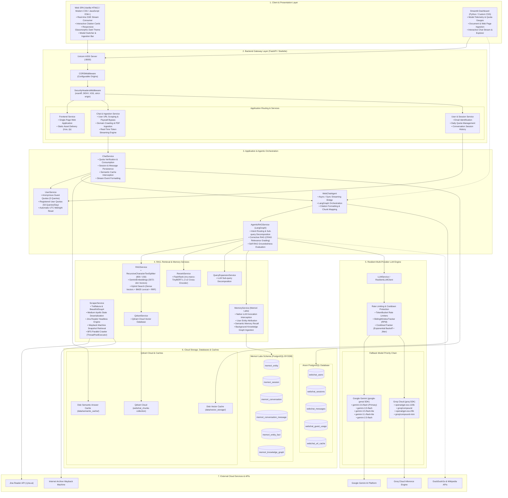
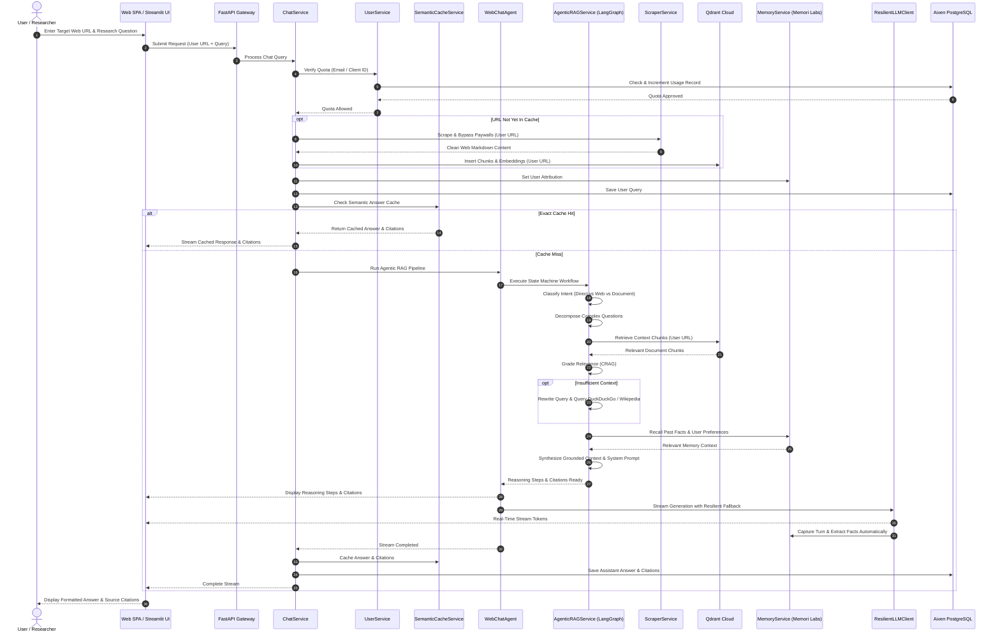
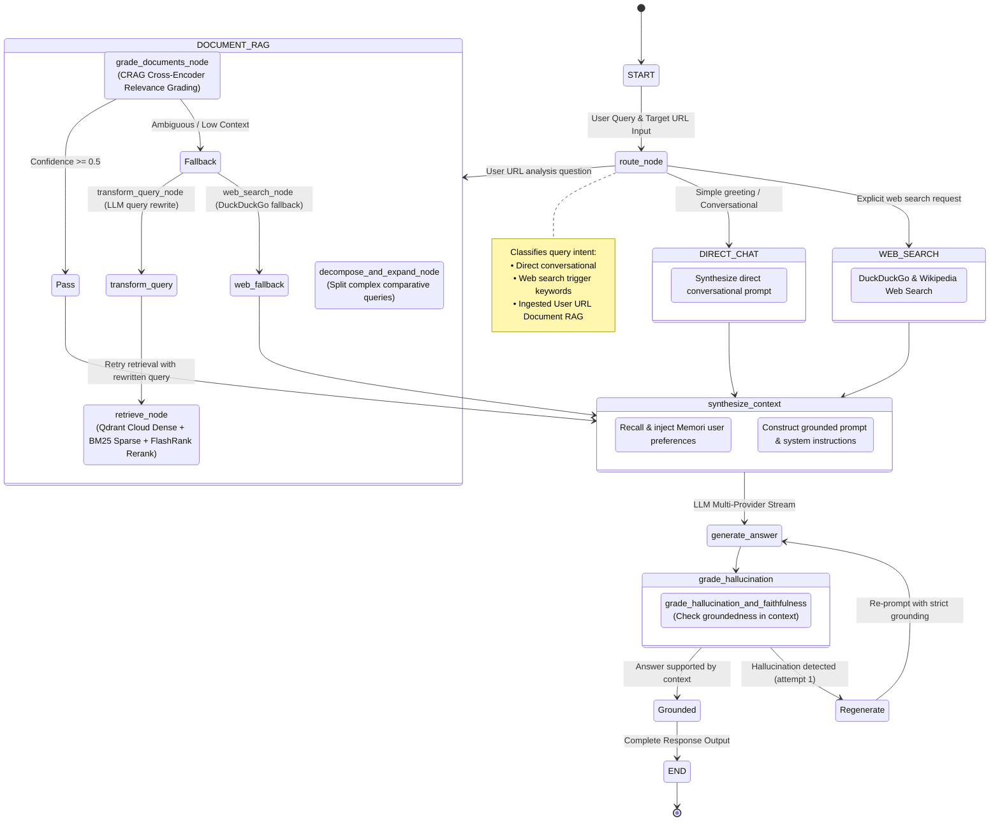

# WebChat AI — Autonomous Web Intelligence & Agentic RAG Platform

<p align="center">
  
  
  
  
  
  
  
  
  
</p>

WebChat AI is an enterprise-grade conversational AI platform designed for autonomous web research and deep document intelligence. Users can provide any web URL (technical documentation, blogs, research papers, news articles, or gated publications) to extract content, build hierarchical vector indices, and engage in grounded multi-turn conversations backed by citations.

The platform orchestrates **LangGraph** agentic reasoning (Corrective RAG + Self-RAG), hybrid retrieval across **Qdrant Cloud** and sparse BM25, multi-provider LLM priority cascades (Google Gemini & Groq), persistent user semantic memory powered by **Memori Labs**, and managed database persistence on **Aiven PostgreSQL**.

For comprehensive technical specifications, class designs, and deep architectural analysis, refer to [ARCHITECTURE.md](ARCHITECTURE.md).

---

## Architecture Overview

### High-Level System Architecture



---

## User URL & End-to-End Data Flow

This diagram illustrates how WebChat AI handles user research queries against any targeted web URL, orchestrating ingestion, hybrid retrieval, agentic reasoning, and token streaming.



---

## Agentic RAG Pipeline (LangGraph Workflow)



---

## Key Capabilities

### Chat with Any User URL
- **Instant Web Intelligence**: Users enter any public URL to scrape, clean, chunk, embed, and chat with the page contents in real time.
- **Paywall & Gating Bypass**:
  - Direct scraping with realistic browser headers via `Trafilatura` and `BeautifulSoup4`.
  - Deserialization of Medium Apollo State (`window.__APOLLO_STATE__`) to retrieve complete subscriber-only article text.
  - Headless markdown extraction via Jina Reader (`r.jina.ai`) for client-side JavaScript rendering.
  - Automatic historical snapshot extraction from the Internet Archive Wayback Machine.
- **Document Ingestion**: Upload PDF or text files for instant chunking, embedding, and cross-document querying.
- **Deep Domain Crawling**: Breadth-First Search (BFS) crawler using `concurrent.futures.ThreadPoolExecutor` to crawl and index entire documentation domains.

### LangGraph Agentic RAG & Hybrid Retrieval
- **Cyclic StateGraph**: Orchestrates routing, query decomposition, retrieval, grading, query rewriting, and hallucination evaluation.
- **Hybrid Search with RRF**: Combines 3072-dimensional dense embeddings (`GeminiEmbeddings`) and sparse lexical search (`rank-bm25`) using Reciprocal Rank Fusion ($k=60$).
- **Cross-Encoder Reranking**: Low-latency local cross-encoder scoring via FlashRank (`ms-marco-TinyBERT-L-2-v2`).
- **Corrective RAG (CRAG)**: Grades retrieved context relevance; rewrites queries and searches DuckDuckGo and Wikipedia when context is missing.
- **Self-RAG Groundedness**: Verifies generated answers against source text to prevent hallucinations.

### 10-Tier Resilient LLM Cascade
- Automatic priority fallback between Google Gemini and Groq if rate limits or provider issues occur:
  - `gemini-3.6-flash` (Primary)
  - `openai/gpt-oss-120b` (Groq Fallback)
  - `gemini-3.5-flash`
  - `groq/compound`
  - `gemini-3.5-flash-lite`
  - `openai/gpt-oss-20b`
  - `gemini-3.1-flash-lite`
  - `groq/compound-mini`
  - `gemini-2.5-flash` / `gemini-2.5-flash-lite`
- **Circuit Breakers**: TokenBucket rate limiting, sliding-window RPM monitoring, and exponential backoff with jitter.

### Persistent Semantic Memory (Memori Labs)
- **Automatic Interception**: Connects with the LLM client to record conversations and identify facts automatically.
- **User Attribution**: Links memory graphs and preferences to the user identity.
- **Cloud Schema**: Structured relational entities, sessions, messages, and knowledge graph facts stored in Aiven PostgreSQL.

### Tiered Quotas & Security
- **Guest Tier**: 5 queries tracked by client device UUID.
- **Registered User Tier**: 50 queries per day tracked by email, automatically reset at `00:00:00 UTC`.
- **Hardened HTTP Headers**: Injected via `SecurityHeadersMiddleware` (`nosniff`, `DENY`, `X-XSS-Protection`, strict referrer policy).

---

## Repository Layout

```
webchat/
├── backend/
│   ├── app/
│   │   ├── agents/          # Autonomous agents & stream bridges (chat_agent.py)
│   │   ├── api/             # HTTP routing controllers (chat, user, frontend)
│   │   ├── cache/           # Semantic cache & vector cache stores
│   │   ├── clients/         # Provider clients (gemini_client.py, groq_client.py, llm_client.py)
│   │   ├── core/            # Config, DB connection, security, rate limiting, logging
│   │   ├── dtos/            # Pydantic v2 validation schemas
│   │   ├── helpers/         # URL, text, and stream formatting utilities
│   │   ├── models/          # SQLAlchemy entities (users, sessions, messages, caches)
│   │   ├── repositories/    # Database repository layer
│   │   └── services/        # LangGraph, RAG, reranker, scraper, memory, user, and chat services
│   ├── config/              # Central database connection factory (Aiven PostgreSQL)
│   ├── .env.example         # Template for required environment variables
│   ├── .python-version      # Target Python runtime version (3.13)
│   ├── main.py              # Unified FastAPI application factory, routes & CLI launcher
│   ├── pyproject.toml       # Backend Astral UV manifest & dependency definitions
│   ├── pyrightconfig.json   # Backend-scoped Pyright configuration
│   ├── requirements.txt     # Exported dependency requirements
│   └── uv.lock              # Reproducible UV dependency lockfile
│
├── frontend/                # Single-Page Web Client (HTML5, Vanilla CSS, JS ES6+)
│   ├── index.html           # Modern glassmorphic interface layout
│   ├── index.css            # Dark theme styles, responsive drawer, animations
│   └── app.js               # Real-time SSE streaming reader, citation drawer
│
├── streamlit_app/           # Analytical Dashboard & Visualizer
│   ├── app.py               # Streamlit application entry point
│   ├── styles.py            # Custom CSS theming
│   ├── requirements.txt     # Streamlit deployment requirements
│   └── components/          # Modular UI components (header, sidebar, chat)
│
├── data/                    # Persistent disk storage (semantic cache, vector indices)
├── .gitignore               # Git exclude rules for secrets, caches, and venvs
├── ARCHITECTURE.md          # Comprehensive technical design document
├── pyrightconfig.json       # Monorepo Pyright configuration
└── README.md                # System documentation
```

---

## Process & Runtime Architecture (`backend/main.py`)

The application provides a unified execution entrypoint in [backend/main.py](file:///d:/Projects/Personal-Projects/webchat/backend/main.py) that detects execution arguments and starts the chosen interface, as well as exposing `app` for direct ASGI deployment.

```mermaid
graph TB
    subgraph CLI_Entry ["Process Launcher (backend/main.py)"]
        CLI["python backend/main.py [service]"]
        Detect{"Detect Mode & Context"}
        CLI --> Detect
    end

    subgraph Service_Execution ["Runtime Processes"]
        Detect -->|service == 'backend' or 'api' (default)| Backend_Proc["FastAPI Application (Uvicorn ASGI)<br/>uvicorn.run('backend.main:app', host, port)<br/>Default: 0.0.0.0:8000"]
        Detect -->|service == 'streamlit'| Streamlit_Proc["Streamlit Analytical Dashboard<br/>subprocess.call([sys.executable, '-m', 'streamlit', 'run', 'streamlit_app/app.py'])<br/>Default: localhost:8501"]
    end

    subgraph Backend_Subsystems ["FastAPI Application Subsystems"]
        Lifespan["Application Lifespan<br/>• Database connection & table setup<br/>• Memori Labs BYODB storage build<br/>• Semantic & vector cache pre-warming"]
        Static_Mounts["Static Asset Mounts<br/>• /css -> frontend/css<br/>• /js -> frontend/js<br/>• /static -> frontend/"]
        App_Services["Application Core Services<br/>• Chat & Ingestion Engine<br/>• User & Quota Management<br/>• Single-Page Web Application UI"]
        
        Backend_Proc --> Lifespan
        Lifespan --> Static_Mounts
        Lifespan --> App_Services
    end

    subgraph Cloud_Storage ["Cloud Storage & Databases"]
        Cloud_DB[("Aiven PostgreSQL Database<br/>Configured via DB_USER, DB_PASSWORD, DB_HOST, DB_NAME<br/>• Application relational tables<br/>• Memori Labs BYODB tables")]
        Cloud_Qdrant[("Qdrant Cloud Vector Database<br/>Configured via QDRANT_URL, QDRANT_API_KEY")]
        Local_Cache["Local Cache Filesystem (data/)<br/>• data/semantic_cache/*.json<br/>• data/vector_storage/<hash>/"]
    end

    subgraph External_APIs ["External Cloud Services"]
        API_Gemini["Google Gemini AI API (google-genai SDK)"]
        API_Groq["Groq Cloud API (groq SDK)"]
        API_DDG_Wiki["DuckDuckGo Instant Answer & Wikipedia APIs"]
        API_Jina["Jina Reader API (r.jina.ai)"]
        API_Wayback["Internet Archive Wayback Machine"]
    end

    App_Services --> Cloud_DB
    App_Services --> Cloud_Qdrant
    App_Services --> Local_Cache
    App_Services --> External_APIs
    Streamlit_Proc -.->|Agent Bridge| App_Services
```

---

## Installation & Setup (New User Quickstart)

### 1. Prerequisites
- **Python**: Version `3.11`, `3.12`, or `3.13` installed.
- **Git**: Installed.
- **Package Manager**: [Astral UV](https://docs.astral.sh/uv/) (Recommended for ultra-fast setup) or standard `pip`.

### 2. Clone the Repository
```bash
git clone https://github.com/LaxmiNarayana31/webchat.git
cd webchat
```

### 3. Create Virtual Environment & Install Dependencies

#### Using Astral UV (Recommended)
```bash
cd backend
uv sync
cd ..
```

#### Using Standard Python `venv` & `pip`
**On Windows (PowerShell):**
```powershell
python -m venv .venv
.\.venv\Scripts\Activate.ps1
pip install -r backend/requirements.txt
```

**On Linux / macOS:**
```bash
python3 -m venv .venv
source .venv/bin/activate
pip install -r backend/requirements.txt
```

### 4. Configure Environment Variables (`.env`)

Copy the template file to `backend/.env` (or root `.env`):

**On Windows (PowerShell):**
```powershell
Copy-Item backend/.env.example backend/.env
```

**On Linux / macOS:**
```bash
cp backend/.env.example backend/.env
```

Generate your secure `URL_HASH_SECRET` with Python:
```bash
python -c "import secrets; print(secrets.token_hex(32))"
```

Edit `backend/.env` and paste your credentials:

```env
# https://console.aiven.io/ (Optional - defaults to local SQLite)
DB_USER=
DB_PASSWORD=
DB_HOST=
DB_PORT=5432
DB_NAME=defaultdb
SSL_MODE=require

# https://aistudio.google.com/api-keys
GEMINI_API_KEY=your_gemini_key

# https://console.groq.com/keys
GROQ_API_KEY=your_groq_key

# https://cloud.qdrant.io/ (Optional - defaults to local FAISS)
QDRANT_URL=
QDRANT_API_KEY=

# Cryptographic URL Cache Hashing
URL_HASH_ALGORITHM=sha256
URL_HASH_SECRET=your_32_byte_generated_hex_secret
```

### 5. Pre-flight Verification & Database Initialization

Run the pre-flight verification command to test your environment and initialize database tables:
```bash
# Verify backend imports and initialize tables:
python -c "from backend.config.database import init_db; init_db(); print('Environment and database ready!')"
```

---

## Running the Application

### Option A: Modern Single-Page Web Application (FastAPI Backend + Built-in Web UI)

The FastAPI server automatically serves the modern glassmorphic Web SPA at the root URL (`http://localhost:8000`).

```bash
# Using UV
uv run --project backend python backend/main.py

# Or with active virtual environment:
python backend/main.py --host 0.0.0.0 --port 8000 --reload
```

- **Web App**: Open [http://localhost:8000](http://localhost:8000) in your browser.
- **Swagger API Docs**: Open [http://localhost:8000/docs](http://localhost:8000/docs).

### Option B: Streamlit Analytical Dashboard

```bash
# Using UV
uv run --project backend python backend/main.py streamlit

# Or with active virtual environment:
python backend/main.py streamlit
```

- **Dashboard**: Open [http://localhost:8501](http://localhost:8501) in your browser.

---

## Quality & Architectural Standards

The codebase adheres strictly to enterprise Python best practices:
- **Zero `__init__.py` Files**: Modern namespace packages across all internal subdirectories.
- **Deterministic Imports**: Strictly top-level module imports; zero inline imports or guarded try-except import blocks.
- **Robust Exception Handling**: Start-to-end `try...except` exception boundaries in all functions with contextual logging.
- **Zero Deprecated Constructs**: Built on `google-genai` official SDK, `Pydantic v2`, and `FastAPI lifespan`.

---

## License

This project is licensed under the MIT License.
